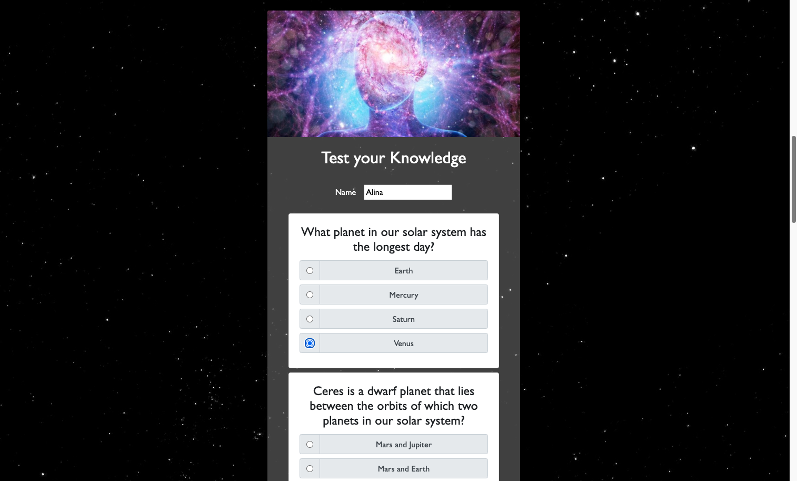

# Explore our Solar System

CodeClan JavaScript Group Project

### How to run the application

* npm install
* Packages to install: npm i howler npm i bootstrap
* Client: npm run serve, Server: npm run server:dev

### The brief 

The BBC are looking to improve their online offering of educational content by developing some interactive browser applications that display information about our Solar System in a fun and interesting way. Your task is to make a Minimum Viable Product or prototype to put forward to them - this may only be for a small set of information, and may only showcase some of the features to be included in the final app.

A user should be able to:

- View some educational content on the planets in our Solar System
- Retrieve information from an external API and display it on the page
- Be able to interact with the page to move through different sections of content

### Extensions

- Create a quiz that allows the user to test their knowledge about the Solar System
- Calculate score for each taken quiz and store them in a database
- Display a Leaderboard (Top 10)
- Use charts or maps to display your information to the page

### Technologies used
- JavaScript
- Vue.js
- MongoDB
- HTML, CSS
- Bootstrap

When opening the Application the user can see a slideshow with five pictures of our Solar System including an interesting fact:

Underneath is a list of all the planets and dwarf planets. When the user clicks on a specific planet, more details are being displayed.

When the user clicks on "Test your knowledge", the app requests questions from an API and displays ten unique and random questions. This way, the user can take the quiz more than once and receives a slightly or completely different quiz each time.

After submitting the name and the quiz (all questions need to be answered), the user receives a visual feedback which questions had been answered correclty as well as a Leaderboard of the ten highest scores. If the user scored enough points, their name will appear in the Top Ten.

